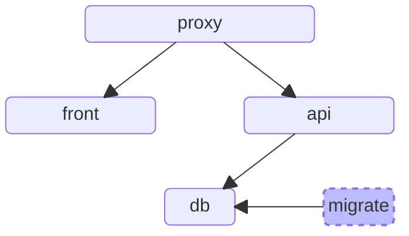

# Getting Started with Geoshop
This page will guide you through the process of installing Geoshop locally. To follow these steps, you'll need Docker.

## Get the code

Geoshop solution is separated in 3 distinct projects:

* The [backend](https://github.com/camptocamp/geoshop-back), a Django Rest Framework based API
* The [frontend](https://github.com/camptocamp/geoshop-front) based on Angular
* [Extract](https://github.com/asit-asso/extract), a Java based geodata export orchestrator

Each project is designed to run independently on its own server, but their full potential is realized when they are integrated.

For your convenience, we have prepared a GitHub repository that accomplishes exactly that:

```sh
git clone --recurse-submodules https://github.com/sitn/geoshop-demo.git
cd geoshop-demo
cp .env.sample .env
docker compose up -d
```
Once everything is set up, your app should be accessible at https://localhost.

If you receive a warning indicating that your connection is not private, simply click the *Advanced* button and proceed.

## What happened?
The application is running the local code within containers. To prevent cross-origin issues, a proxy serves both the frontend and backend at https://localhost.



The `migrate` container runs the initial database migrations to set up the database and then shuts down.

## What's next?

Congratulations! You now have a local instance of Geoportal running. You can proceed to the [tutorial](./tutorial/1-publish-product).
